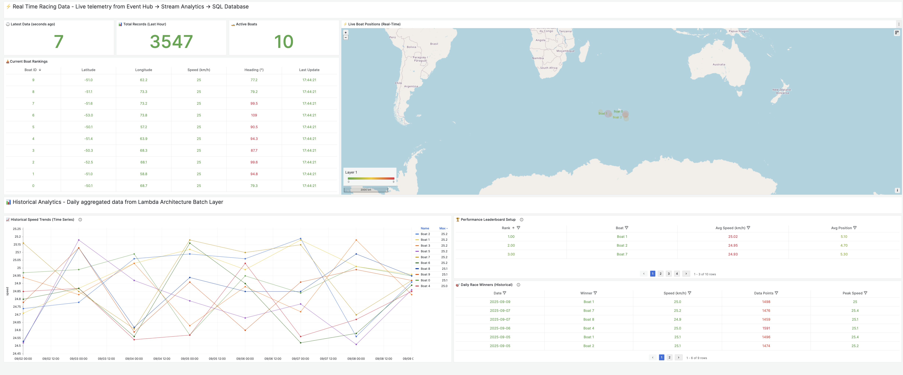
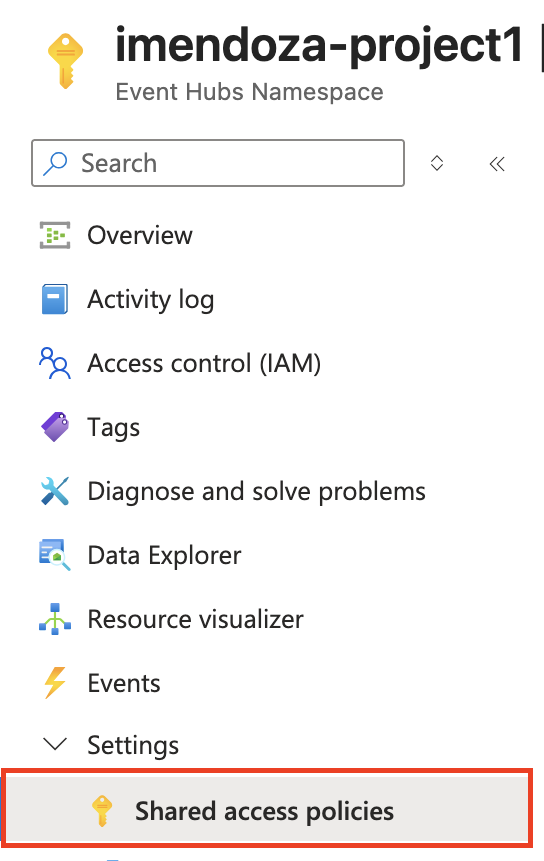
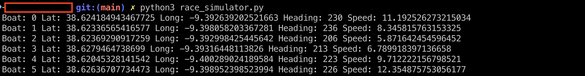

ac# **⛵ Boat Racing: A Data Engineering project using Lambda Architecture**

Author: Ivonne Mendoza, Data Devotee.

Welcome to my new personal project for learning more about Data Engineering tools and techniques. Below, you can find snippets and explanations on this new journey.

# **Snapshot from grafana**

You can see a snapshot from Grafana’s dashboard on this link.
https://cosmolabs.grafana.net/dashboard/snapshot/pgkUxOtA2bfSPZVNmP2WSXFMCj0Os3xH  

There are two main sections: real-time data and historical data with insights and a rankings table.  



# **Table of Contents**

1. [Project Overview](#Project-Overview)
2. [Data Overview](#Data-Overview)
3. [Architecture](#Architecture)
4. [Technical requirements](#Technical-requirements-tools)
5. [Scripts](#Scripts)  
6. [Steps](#Steps)
6. [Final thoughts and next steps](#Final-thoughts-and-next-steps)

# **Project Overview**

This project is an implementation of a lambda architecture for Boat Racing Analysis using the Azure ecosystem, SQL, Parquet files, and Grafana for visualization. The purpose of this experiment is to learn in depth about Azure products and solutions for this specific use case.

Lambda architecture is a well-known and popular architecture for processing real-time data. In short, this architecture consists of a layer that processes real-time data, another batch layer that saves information for historical analysis, and a serving layer that stores real-time and batch data. It could be complex, but this kind of project is an excellent starting point to learn and understand the complexities of this kind of architecture. 

# **Data overview**

Vendée Globe is a yacht race that a solo sailor handles. It’s a non-stop race that sails around the world.  
We do not have access to the real data, but we can *simulate it.* That is the purpose of the script race\_simulator.py. It simulates a race, calculates latitude and longitude, and establishes some velocity parameters and starting points for this race. In addition, it connects with Azure Event Hub to collect data. However, this script is not perfect. Sometimes it sends corrupted data, so one of the requests for this case is to handle the data before proceeding with the next steps.

# **🏗️ Architecture**
## Real-time pipeline      
Event Hub → Stream Analytics → SQL Database

## Batch layer pipeline
Python → Parquet → Azure Blob Storage

## Serving layer
SQL queries → Grafana

# **Technical requirements \- tools**

\- Python  
\- SQL (SQL Server)  
\- Bash   
\- Azure for real-time and batch processing (Event Hub, Stream Analytics, Blob container, and SQL Database)  
\- Grafana for visualization

# **Scripts**

race\_simulator.py: Simulates the live positions of a fleet of sailing boats racing. Run first to initialize the simulation.  
monitor\_data.py: Check if data is going through from Stream Analytics to SQL Database.  
simple\_parquet\_batch: Extract data from SQL Database, analyze it, and send historical data as a parquet file (Azure Blob Storage)  
parquet\_to\_sql: Captures parquet files from Blob Storage and sends them to SQL Database

# **Steps**

The first thing you need is an Azure Account. This project is budget-friendly, so you can use free credits as you wish. For Grafana, it is a similar case scenario; they offer a generous free trial period, and I used that for this project. In case you do not want to use Grafana, you can stick to the Power BI visualization tool.

## Create Azure Lambda Architecture resources.

You can do this manually or using an automation tool like *Terraform.* For this time, the goal is to create resources directly in the Azure Portal.   

The first step (if you want to start from scratch with Azure) is to create a ***Resource group*** to contain the necessary tools to run the Lambda architecture.

To capture data from the *race\_simulator.py,* create an Event Hub Namespace in Azure and then an Event Hub instance to capture events.  

Once you have created the event hub environment, it is time to make the stream analytics job resource. This step is crucial for processing data and creating input and output for further analysis. In the job topology section, you can add input and output for this project.

Before running the *race\_simulator.py,* it is mandatory to obtain the Azure Keys to connect with the Event Hub and then send data to Azure.

Go to the event hub namespace resource → Settings → Shared Access Policies. Choose your project and go to the section Primary connection string, copy the keys, and add them to race\_simulator.py 



```
NAMESPACE\_CONNECTION\_STR \= os.getenv('AZURE\_EVENTHUB\_CONNECTION\_STRING')  
EVENTHUB\_NAME \= os.getenv('AZURE\_EVENTHUB\_NAME', 'project1')  
```    

Now, the script is ready to use. In this case, for security reasons, it is not a good idea to hardcode these security keys. Please use an env file and .gitignore to anonymize this. 

```
python3 race_simulator.py  
```

If everything is running ok, the race simulator starts to send data similar to this:




   
# **Final thoughts and next steps**  
I remember the first time I touched this code. It was for a traineeship, and at that time, it was more about completing it on a tight schedule than learning and, even more, understanding what I was doing and why.  
Things have changed since then, and now, just for fun, I recreate this project from my perspective. I modified the original simulator for fast-moving boats, changed the visualization tool, and created more scripts to run this project from my terminal, leaving the necessity to use a GUI interface for managing cloud services.  
And then, I changed the visualization tool. Power BI is great, but there are some limitations to this tool, and I always want to explore other approaches.  
That is why I chose Grafana for this. It is versatile, offers good support for connecting different data sources, and is open source. Perfect for case studies like this.  
For next steps, I would like to explore Terraform for more abstractions in cloud infrastructure, and of course, try Kafka.

