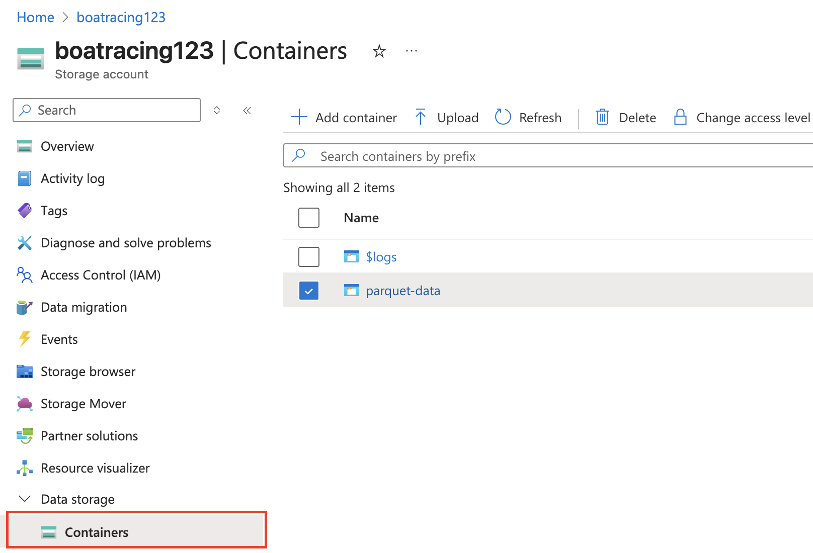

# **⛵ Boat Racing: A Data Engineering project using Lambda Architecture**

Author: Ivonne Mendoza, Data Devotee.

Welcome to my new personal project for learning more about Data Engineering tools and techniques. Below, you can find snippets and explanations on this new journey.


# **💡Snapshot**

You can see a snapshot from Grafana’s dashboard on this link.
https://cosmolabs.grafana.net/dashboard/snapshot/pgkUxOtA2bfSPZVNmP2WSXFMCj0Os3xH  

There are two main sections: real-time data and historical data with insights and a rankings table.  


# **🧾 Table of Contents**

1. [Project Overview](#Project-Overview)
2. [Data Overview](#Data-Overview)
3. [Questions about data](#Questions-about-data)
4. [Architecture](#Architecture)
5. [Technical requirements](#Technical-requirements-tools)
6. [Scripts](#Scripts)
7. [Steps](#Steps)
8. [Final thoughts and next steps](#Final-thoughts-and-next-steps)


# **🧭 Project Overview**

This project is an implementation of a lambda architecture for Boat Racing Analysis using the Azure ecosystem, SQL, Parquet files, and Grafana for visualization. The purpose of this experiment is to learn in depth about Azure products and solutions for this specific use case.

Lambda architecture is a well-known and popular architecture for processing real-time data. In short, this architecture consists of a layer that processes real-time data, another batch layer that saves information for historical analysis, and a serving layer that stores real-time and batch data. It could be complex, but this kind of project is an excellent starting point to learn and understand the complexities of this kind of architecture. 
  
  
# **📈 Data Overview**
Vendée Globe is a yacht race that a solo sailor handles.   
It is a non-stop race that sails around the world.  
We do not have access to the real data, but we can *simulate it.* That is the purpose of the script **race_simulator.py**. It simulates a race, calculates latitude and longitude, and establishes some velocity parameters and starting points for this race. In addition, it connects with Azure Event Hub to collect data. However, this script is not perfect. Sometimes it sends corrupted data, so one of the requests for this case is to handle the data before proceeding with the next steps.
  
  
# **❓ Questions about data**
Before moving to the architecture implementation, it is crucial to think about what kind of questions or data necessities you can solve or elucidate with this approach. With this implementation and then using a visualization tool, we can answer some interesting things about sail racing, like:

- What is the real-time position of every boat in this race?
- At this moment, which boat is leading the race?
- How many records are being processed by the Stream Analytics?
- What about boats' performance over time?
- Who is the leader for the day in this competition?


# **🏗️ Architecture**

  

Real-time pipeline: Event Hub → Stream Analytics → SQL Database

Batch layer pipeline: Python → Parquet → Azure Blob Storage

Serving layer: SQL queries → Grafana


# **🧰 Technical requirements \- tools**

- Python, SQL (SQL Server),Bash   
- Azure for real-time and batch processing (Event Hub, Stream Analytics, Blob container, and SQL Database)  
- Visual Studio Code for SQL database viewing and querying
- Grafana for visualization


# **💼 Scripts**

race_simulator.py: Simulates the live positions of a fleet of sailing boats racing. Run first to initialize the simulation.  
monitor_data.py: Check if data is going through from Stream Analytics to SQL Database.  
simple_parquet_batch: Extract data from SQL Database, analyze it, and send historical data as a parquet file (Azure Blob Storage)  
parquet_to_sql: Captures parquet files from Blob Storage and sends them to SQL Database


# **🔦 Steps**

The first thing you need is an Azure Account. This project is budget-friendly, so you can use free credits as you wish. For Grafana, it is a similar case scenario; they offer a generous free trial period, and I used that for this project. In case you do not want to use Grafana, you can stick to the Power BI visualization tool.

### Create Azure Lambda Architecture resources.

You can do this manually or using an automation tool like *Terraform.* For this time, the goal is to create resources directly in the Azure Portal.   

The first step (if you want to start from scratch with Azure) is to create a ***Resource group*** to contain the necessary tools to run the Lambda architecture.

To capture data from the *race\_simulator.py,* create an Event Hub Namespace in Azure and then an Event Hub instance to capture events.  

Once you have created the event hub environment, it is time to make the stream analytics job resource. This step is crucial for processing data and creating input and output for further analysis. In the job topology section, you can add input and output for this project.

Before running the *race\_simulator.py,* it is mandatory to obtain the Azure Keys to connect with the Event Hub and then send data to Azure.

Go to the event hub namespace resource → Settings → Shared Access Policies. Choose your project and go to the section Primary connection string, copy the keys, and add them to race\_simulator.py 


```
NAMESPACE_CONNECTION_STR = os.getenv('AZURE_EVENTHUB_CONNECTION_STRING')  
EVENTHUB_NAME = os.getenv('AZURE_EVENTHUB_NAME', 'project1')  
``` 

Now, the script is ready to use. In this case, for security reasons, it is not a good idea to hardcode these security keys.  
Please use an env file and .gitignore to anonymize this. 

Run the race simulator in your terminal:

```
python3 race_simulator.py  
```

If everything is running ok, the race simulator starts to send data similar to this:


### Capture real-time events

#### Setting up input  

At this moment, a resource group and an event hub, plus the race simulator, are complete. Now it is time to create steps to capture data as input, clean it, and send it as an output for further analysis. 

Stream Analytics is the correct choice for this because this resource acts as a transformation data layer for the project.

When the Stream Analytics Job is created, go to the job topology section on the Stream Analytics menu and add an input. In this case, the input is the event hub that you created previously.


#### Setting up output and SQL Database  

The input settings are ready, and now it is time to orchestrate the output section.   
To complete this, we need to add a new resource to our resource pool: A SQL Database aligned with a SQL server layer. If you don’t have a database set up, this is the moment to create one in Azure. 

Because it is a Lambda Architecture setup, we need to create two tables in SQL to achieve saving real-time data and batch data for historical analysis.

For real-time data output, we will create a boat-telemetry table to save all outputs. Add this table as an output in the output section of the Stream Analytics Job.


As discussed before, the race simulator could be generating some corrupted data. To avoid sending incorrect information to the output, a pre-processing step is mandatory. To achieve this in the query section, you can transform data using an SQL query. 

```
SELECT
    TRY_CAST(boat as bigint) as boat_id,
    TRY_CAST(latitude as float) as latitude,
    TRY_CAST(longitude as float) as longitude,
    TRY_CAST(heading as float) as heading,
    TRY_CAST(speed as float) as speed,
    TRY_CAST(EventProcessedUtcTime as datetime) as event_time,
    TRY_CAST(EventEnqueuedUtcTime as datetime) as enqueued_time
INTO
    [boat-telemetry-sql]  -- This will be your new SQL Database output
FROM
    [project1]
WHERE 
    -- Filter out corrupted GPS data
    latitude != -10000.0 
``` 
To summarize  
from project1: the input that we created previously  
into boat-telemetry-sql: the database output to store data  
Test query in the same editor. If data runs smoothly, it's time to move on to the next step.


### Capture batch events with Parquet files

We have created the first layer for the Lambda architecture, which is the real-time layer. After that, we need to work on the batch layer architecture. The batch layer will store the historical data that can be used by the visualization tool.  

To achieve this, we need another Azure resource: a blob storage account to store the batch files in Parquet format. Why parquet? For a better performance and more related to real-world data engineering projects.

Go to your resource group in Azure and add a storage account with a suitable container. Then, save the connection string for the next step.

In this repo, you can find the file **simple_parquet_file.py**, which extracts data from the boat_telemetry table and stores it as a parquet file into the storage resource.  

```
"""
Simple Parquet + Azure Blob Batch Processor
Lambda Architecture study case 
Usage source database.env && source azure_storage.env && python3 simple_parquet_batch.py
"""

import pandas as pd
import pyodbc
import os
from datetime import date
from azure.storage.blob import BlobServiceClient
from io import BytesIO

def get_db_connection():
    """Simple database connection with extended timeout"""
    return pyodbc.connect(
        f"DRIVER={{ODBC Driver 17 for SQL Server}};"
        f"SERVER={os.getenv('SQL_SERVER')};"
        f"DATABASE={os.getenv('SQL_DATABASE')};"
        f"UID={os.getenv('SQL_USERNAME')};"
        f"PWD={os.getenv('SQL_PASSWORD')};"
        f"Encrypt=yes;TrustServerCertificate=yes;"
        f"Connection Timeout=60;"  # Extended timeout for Azure SQL
    )
```

After executing the script, you can see some parquet files in the storage section.   




Now, we can send data to the historical SQL table for this.  
As we previously mentioned, we need two SQL tables to save real-time and historical data.  
We already have one; we need to set up the historical table to send the parquet files.  
To achieve this, we can use the script **parquet_to_sql.py**. This script creates (if it does not exist) the proper table to send Parquet files to it.

```
# Create historical rankings table
create_table_sql = """
  IF NOT EXISTS (SELECT * FROM sysobjects WHERE name='boat_historical_rankings' AND xtype='U')
  CREATE TABLE boat_historical_rankings (
      date DATE NOT NULL,
      boat_id INT NOT NULL,
```


If you are curious, just like me, and want to query the tables and check the info inside them, you can use Visual Studio Code to add a connection with your Azure SQL Database and then explore our new databases:


Finally, the lambda architecture is set and ready to collect data and store it.

By the end of the lambda architecture implementation, you can see the following resources associated with this project. 


**Do not forget to stop the analytics job runner in case you are not using it. It helps you to save money\!** 


# **🖥️ Visualization with Grafana**

We need to connect real-time and historical data to Grafana. In this case, a connection is helpful because when creating new panels in the dashboard, we collect that information by querying the databases using SQL Syntax.   
To achieve this, go to Grafana main menu/home → Data sources → Add new data sources and choose SQL Server for this. 

Once you complete the Data Source Settings in Grafana, press the button Save and test. If the test is done and your connection is running, you can create a proper dashboard with historical and real-time data.  

In this repo, you can find some queries as an example for Grafana panels.


# **💭Final thoughts and next steps**  
I remember the first time I touched this code. It was for a traineeship, and at that time, it was more about completing it on a tight schedule than learning and, even more, understanding what I was doing and why.  
Things have changed since then, and now, just for fun, I recreate this project from my perspective. I modified the original simulator for fast-moving boats, changed the visualization tool, and created more scripts to run this project from my terminal, leaving the necessity to use a GUI interface for managing cloud services.  
And then, I changed the visualization tool. Power BI is great, but there are some limitations to this tool, and I always want to explore other approaches.  
That is why I chose Grafana for this. It is versatile, offers good support for connecting different data sources, and is open source. Perfect for case studies like this.  
For next steps, I would like to explore Terraform for more abstractions in cloud infrastructure, and of course, try Kafka.

